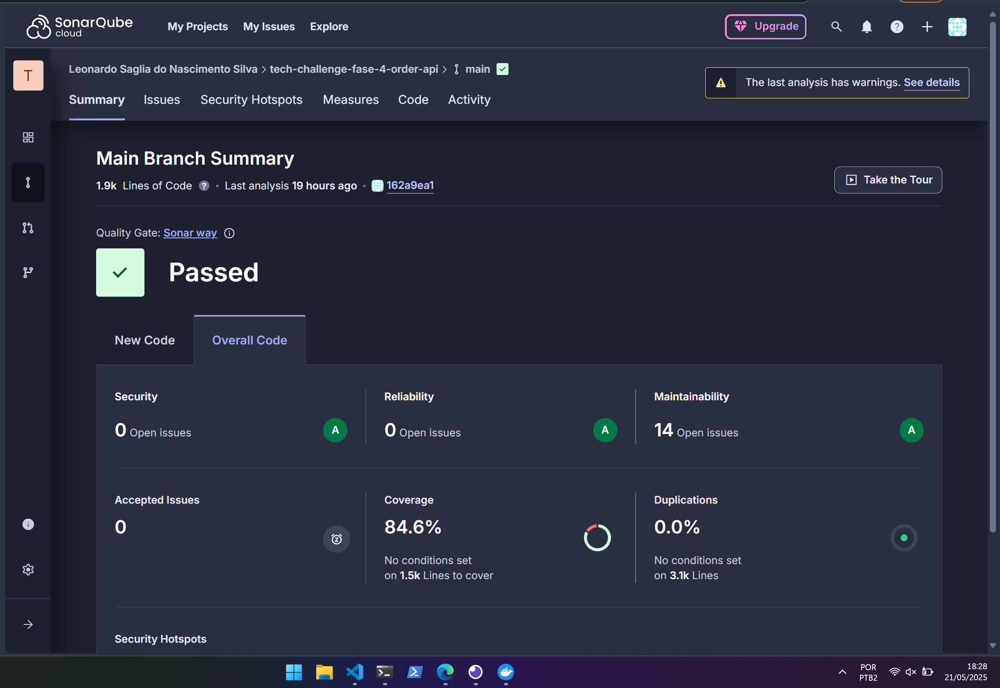

# Tech-challenge-fase-4-order-api

## Evidência cobertura de testes


## 📜 Descrição da Aplicação

Esta aplicação é um desafio técnico para um sistema de gerenciamento de fast food.

É um projeto Node com Typescript, utiliza express para expor a API e Prisma como ORM para comunicação com banco de dados Postgres.

Essa versão da API é especifica para rodar com sucesso na AWS, caso queira rodar local, é necessário realizar algumas adaptações.

## Pré-requisitos para rodar os testes BDD (Cucumber)

1. Certifique-se de ter o [Make](https://www.gnu.org/software/make/) instalado em sua máquina.
   - No Windows, recomenda-se instalar via [Gow](https://github.com/bmatzelle/gow) ou [GnuWin](http://gnuwin32.sourceforge.net/packages/make.htm), ou utilizar o terminal do WSL.

2. Execute o comando abaixo para subir os containers necessários (LocalStack e Postgres):
```
make up
```

3. Crie as filas SQS necessárias:
```
make create-queue
```

4. Gere o arquivo `.env` automaticamente:
```
make create-env-file
```

5. Gere os artefatos do Prisma e execute as migrations:
```
make setup-prisma-db
```

6. Inicie a aplicação em modo desenvolvimento:
```
npm run start:dev
```

7. Execute os testes BDD com Cucumber:
```
npm run test:bdd
```

8. Para parar e remover os containers:
```
make down